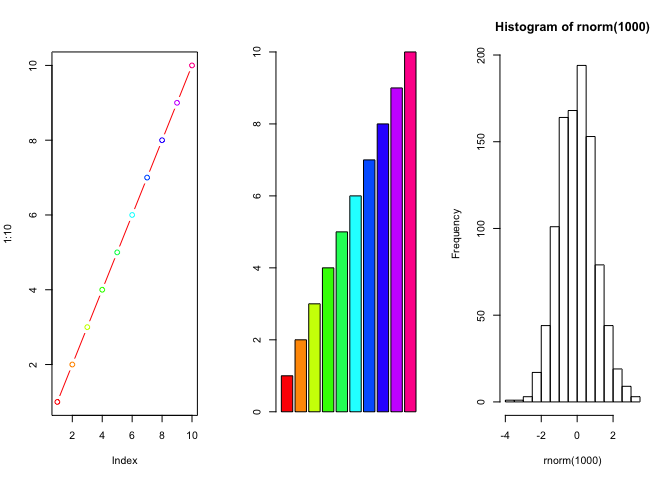

class06
================
Anusorn Mudla
4/19/2019

Overview
--------

Today we will focus on **functions** but we will start with **file reading**

``` r
old.par <- par()
par(mfcol=c(1,3))
plot(1:10,type = "b",col = rainbow(10))
barplot(1:10,col = rainbow(10))
hist(rnorm(1000),bin=50)
```

    ## Warning in plot.window(xlim, ylim, "", ...): "bin" is not a graphical
    ## parameter

    ## Warning in title(main = main, sub = sub, xlab = xlab, ylab = ylab, ...):
    ## "bin" is not a graphical parameter

    ## Warning in axis(1, ...): "bin" is not a graphical parameter

    ## Warning in axis(2, ...): "bin" is not a graphical parameter



``` r
#reset the parameter
par(old.par)
```

    ## Warning in par(old.par): graphical parameter "cin" cannot be set

    ## Warning in par(old.par): graphical parameter "cra" cannot be set

    ## Warning in par(old.par): graphical parameter "csi" cannot be set

    ## Warning in par(old.par): graphical parameter "cxy" cannot be set

    ## Warning in par(old.par): graphical parameter "din" cannot be set

    ## Warning in par(old.par): graphical parameter "page" cannot be set

``` r
data1 <- read.table("test1.txt",header = TRUE,sep = ",")
```

``` r
data2 <- read.table("test2.txt",header = TRUE,sep = "$")
```

``` r
data3 <- read.table("test3.txt")
```

``` r
read.csv("https://bioboot.github.io/bggn213_S19/class-material/test1.txt")
```

    ##   Col1 Col2 Col3
    ## 1    1    2    3
    ## 2    4    5    6
    ## 3    7    8    9
    ## 4    a    b    c

``` r
# function to read file
readfile <- function(file,header,sep) {
  read.table(file,header = header,sep = sep)
}
```

``` r
add <- function(x,y=1) {
  # adding x to y
  x+y
}
add(4)
```

    ## [1] 5

``` r
add(c(1,2,5))
```

    ## [1] 2 3 6

``` r
add(c(1,2,5),3)
```

    ## [1] 4 5 8

``` r
rescale <- function(x) {
    rng <- range(x,na.rm = TRUE)
    (x - rng[1])/(rng[2]-rng[1])
}
```

``` r
rescale2 <- function(x,na.rm = TRUE) {
    rng <- range(x,na.rm=na.rm)
    (x - rng[1])/(rng[2]-rng[1])
}
```

``` r
rescale3 <- function(x, na.rm=TRUE, plot=FALSE) {
   if(na.rm) {
     rng <-range(x, na.rm=na.rm)
   } else {
     rng <-range(x)
   }
   print("Hello")
   answer <- (x - rng[1]) / (rng[2] - rng[1])
   print("is it me you are looking for?")
   if(plot) {
      plot(answer, typ="b", lwd=4)
   }
   print("I can see it in ...")
   return(answer)
}
```

``` r
proteins <- c("1AKE","4AKE")
for (index in proteins) {
  print(index)
}
```

    ## [1] "1AKE"
    ## [1] "4AKE"

``` r
for (index in seq_along(proteins)) {
  print(index)
}
```

    ## [1] 1
    ## [1] 2
