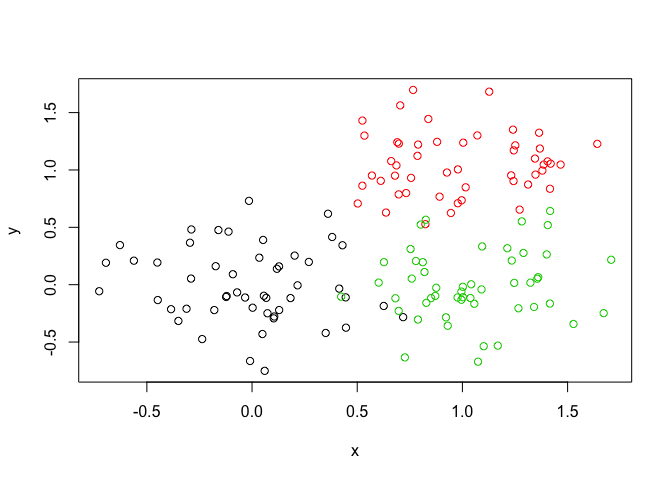
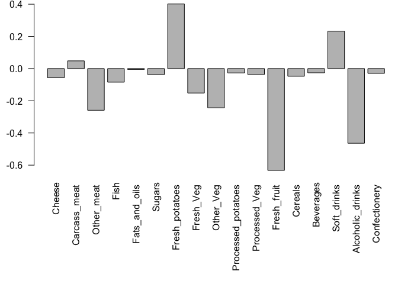

Class08: Introduction
================
Anusorn Mudla
4/26/2019

Class08
-------

Today we will go over machine learning in R (unsupervised learning)

k-mean clustering
-----------------

kmean(x=data,centers = 3,nstarts = 20) \# will generate 3 clusters and iterate 20 times to find the lowerest variances between data...looking for lowest variance. R always returns 3 clusters as you set the "centers" argument. However, sometimes what you set for the number of clusters is not good for the data. The systematic method to determine the number of cluster is to plot scree plot (k vs ss within) to determine the best number of cluster.

``` r
 # Generate some example data for clustering
tmp <- c(rnorm(30,-3), rnorm(30,3))
x <- cbind(x=tmp, y=rev(tmp))
plot(x)
```

 k Use the kmeans() function setting k to 2 and nstart=20

``` r
km <- kmeans(x,centers = 2,nstart = 20)
```

Inspect/print the results Q. How many points are in each cluster?

``` r
table(km$cluster)
```

    ## 
    ##  1  2 
    ## 30 30

Q. What ‘component’ of your result object details - cluster size?

``` r
km$size
```

    ## [1] 30 30

      - cluster assignment/membership?

``` r
km$cluster
```

    ##  [1] 2 2 2 2 2 2 2 2 2 2 2 2 2 2 2 2 2 2 2 2 2 2 2 2 2 2 2 2 2 2 1 1 1 1 1
    ## [36] 1 1 1 1 1 1 1 1 1 1 1 1 1 1 1 1 1 1 1 1 1 1 1 1 1

      - cluster center?

``` r
km$centers
```

    ##           x         y
    ## 1  2.638988 -3.379004
    ## 2 -3.379004  2.638988

Plot x colored by the kmeans cluster assignment and add cluster centers as blue points

``` r
plot(x,col=km$cluster)
points(km$centers,col="blue",pch =3,cex=3)
```


Hierachical Clustering
----------------------

First we need to calculate point (dis)similarity as the Euclidean distance between observations
===============================================================================================

``` r
dist_matrix <- dist(x)
```

The hclust() function returns a hierarchical clustering model
=============================================================

``` r
hc <- hclust(d = dist_matrix)
```

the print method is not so useful here so we need to plot it
============================================================

``` r
plot(hc)
abline(h=6,col="red") # draw a line at height = 6
```


``` r
cutree(hc,h=6) # we can also do cutree(hc,k=2) to specify the number of clusters
```

    ##  [1] 1 1 1 1 1 1 1 1 1 1 1 1 1 1 1 1 1 1 1 1 1 1 1 1 1 1 1 1 1 1 2 2 2 2 2
    ## [36] 2 2 2 2 2 2 2 2 2 2 2 2 2 2 2 2 2 2 2 2 2 2 2 2 2

``` r
gp2 <- cutree(hc,k=2)
gp3 <- cutree(hc,k=3)
table(gp2,gp3)
```

    ##    gp3
    ## gp2  1  2  3
    ##   1 30  0  0
    ##   2  0 23  7

``` r
 # Step 1. Generate some example data for clustering
x <- rbind(
  matrix(rnorm(100, mean=0, sd = 0.3), ncol = 2),   # c1
  matrix(rnorm(100, mean = 1, sd = 0.3), ncol = 2), # c2
  matrix(c(rnorm(50, mean = 1, sd = 0.3),           # c3
           rnorm(50, mean = 0, sd = 0.3)), ncol = 2))
colnames(x) <- c("x", "y")
# Step 2. Plot the data without clustering
plot(x)
```


``` r
# Step 3. Generate colors for known clusters
#         (just so we can compare to hclust results)
col <- as.factor( rep(c("c1","c2","c3"), each=50) )
plot(x, col=col)
```



``` r
hc2 <- hclust(dist(x))
plot(hc2)
gp2<- cutree(hc2,k=2)
gp3 <- cutree(hc2,k=3)
table(gp2,gp3)
```

    ##    gp3
    ## gp2  1  2  3
    ##   1 39  0  0
    ##   2  0 50 61

``` r
plot(hc2)
```


``` r
#can we color the dendalion plot
```

PCA analysis
------------

``` r
## You can also download this file from the class website!
mydata <- read.csv("https://tinyurl.com/expression-CSV",row.names=1)
```

There are 100 gene in this dataset

``` r
#transpose the dataset with t()
pca <- prcomp(t(mydata),scale=TRUE)
summary(pca)
```

    ## Importance of components:
    ##                           PC1    PC2     PC3     PC4     PC5     PC6
    ## Standard deviation     9.6237 1.5198 1.05787 1.05203 0.88062 0.82545
    ## Proportion of Variance 0.9262 0.0231 0.01119 0.01107 0.00775 0.00681
    ## Cumulative Proportion  0.9262 0.9493 0.96045 0.97152 0.97928 0.98609
    ##                            PC7     PC8     PC9      PC10
    ## Standard deviation     0.80111 0.62065 0.60342 3.348e-15
    ## Proportion of Variance 0.00642 0.00385 0.00364 0.000e+00
    ## Cumulative Proportion  0.99251 0.99636 1.00000 1.000e+00

``` r
attributes(pca)
```

    ## $names
    ## [1] "sdev"     "rotation" "center"   "scale"    "x"       
    ## 
    ## $class
    ## [1] "prcomp"

``` r
plot(x=pca$x[,1],y=pca$x[,2])
```


``` r
## Variance captured per PC
pca.var <- pca$sdev^2
## Precent variance is often more informative to look at
pca.var <- pca$sdev^2
pca.var.per <- round(pca.var/sum(pca.var)*100, 1)
pca.var.per
```

    ##  [1] 92.6  2.3  1.1  1.1  0.8  0.7  0.6  0.4  0.4  0.0

``` r
col <- c(rep("red",5),rep("black",5))
plot(x=pca$x[,1],y=pca$x[,2],xlab=paste("PC1 (",pca.var.per[1],"%)", sep = ""),
                             ylab = paste("PC2 (",pca.var.per[2],"%)", sep = ""),col = col)
text(pca$x[,1],pca$x[2])
```


``` r
# identify(x=pca$x[,1],y=pca$x[,2],colnames(mydata))
```

what gene contribute the most to PC1

``` r
gene_score <- sort(abs(pca$rotation[,1]),decreasing = TRUE)
top_5_genes <- names(gene_score[1:5])
top_5_genes
```

    ## [1] "gene100" "gene66"  "gene45"  "gene68"  "gene98"

``` r
pca$rotation[top_5_genes,1]
```

    ##   gene100    gene66    gene45    gene68    gene98 
    ## 0.1038708 0.1038455 0.1038402 0.1038395 0.1038372

Hand-on Worksheet Part 2
------------------------

``` r
food_data <- read.csv(file = "UK_foods.csv",row.names = 1)
## Complete the following code to find out how many rows and columns are in x?
dim(food_data)
```

    ## [1] 17  4

``` r
## Preview the first 6 rows
head(food_data,6)
```

    ##                England Wales Scotland N.Ireland
    ## Cheese             105   103      103        66
    ## Carcass_meat       245   227      242       267
    ## Other_meat         685   803      750       586
    ## Fish               147   160      122        93
    ## Fats_and_oils      193   235      184       209
    ## Sugars             156   175      147       139

``` r
barplot(as.matrix(food_data), beside=T, col=rainbow(nrow(food_data)))
```


``` r
barplot(as.matrix(food_data), beside=F, col=rainbow(nrow(food_data)))
```


``` r
pairs(food_data, col=rainbow(10), pch=16)
```


``` r
# Use the prcomp() PCA function 
pca <- prcomp( t(food_data) )
summary(pca)
```

    ## Importance of components:
    ##                             PC1      PC2      PC3       PC4
    ## Standard deviation     324.1502 212.7478 73.87622 4.189e-14
    ## Proportion of Variance   0.6744   0.2905  0.03503 0.000e+00
    ## Cumulative Proportion    0.6744   0.9650  1.00000 1.000e+00

``` r
# Plot PC1 vs PC2
col <-  c("orange","red","blue","green")
plot(pca$x[,1], pca$x[,2], xlab="PC1", ylab="PC2", xlim=c(-270,500))
text(pca$x[,1], pca$x[,2], colnames(food_data),col = col)
```


``` r
v <- round( pca$sdev^2/sum(pca$sdev^2) * 100 )
v
```

    ## [1] 67 29  4  0

``` r
## or the second row here...
z <- summary(pca)
z$importance
```

    ##                              PC1       PC2      PC3          PC4
    ## Standard deviation     324.15019 212.74780 73.87622 4.188568e-14
    ## Proportion of Variance   0.67444   0.29052  0.03503 0.000000e+00
    ## Cumulative Proportion    0.67444   0.96497  1.00000 1.000000e+00

``` r
barplot(v, xlab="Principal Component", ylab="Percent Variation")
```


``` r
## Lets focus on PC1 as it accounts for > 90% of variance 
par(mar=c(10, 3, 0.35, 0))
barplot( pca$rotation[,1], las=2 )
```


