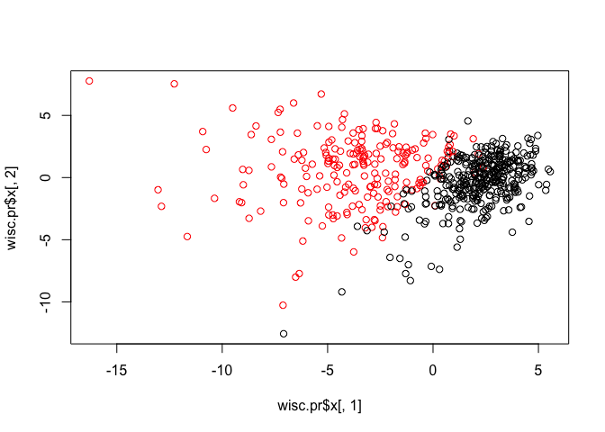
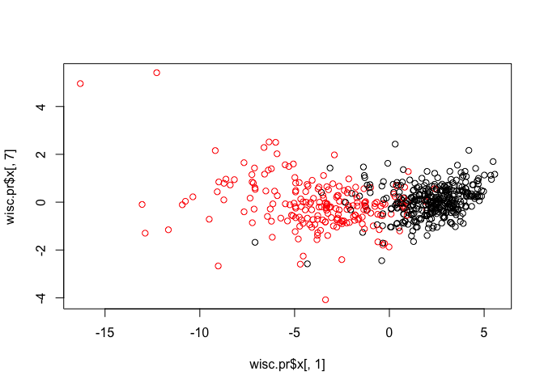
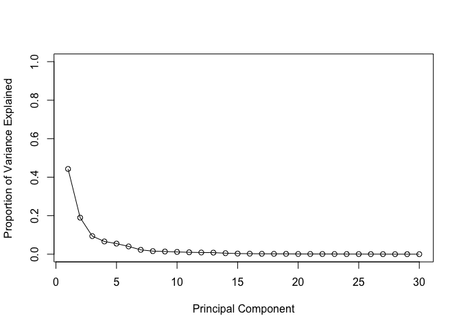
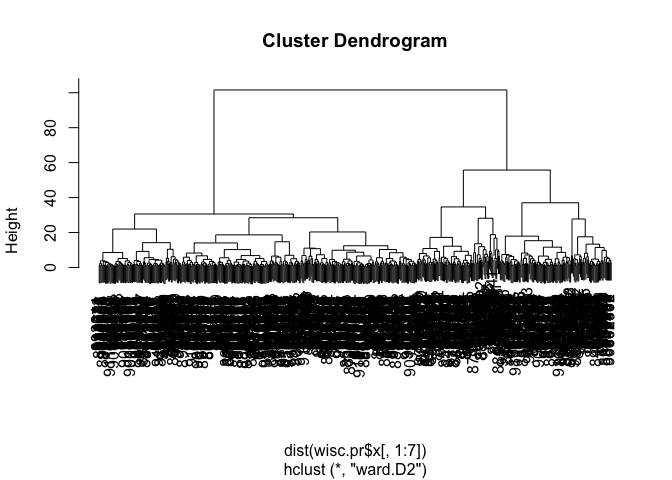
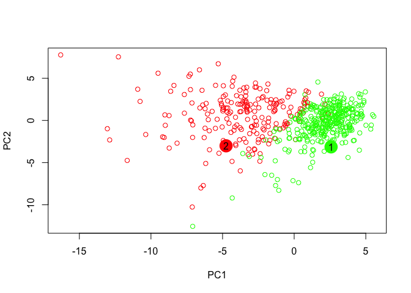

class 9: Unsupervised learning mini-project
================
Anusorn Mudla
5/1/2019

Unsupervised Machine Learning
-----------------------------

``` r
# read the data
cancer <- read.csv("WisconsinCancer.csv")
#Q1.. What type of object is returned from the read.csv() function? 
class(cancer)
```

    ## [1] "data.frame"

``` r
#Q2. How many observations (i.e. patients) are in this dataset?
dim(cancer)
```

    ## [1] 569  33

``` r
nrow(cancer)
```

    ## [1] 569

``` r
#Q3. How many of the observations have a malignant diagnosis?
table(cancer$diagnosis)
```

    ## 
    ##   B   M 
    ## 357 212

``` r
#Q4. How many variables/features in the data are suffixed with _mean?
#length(grep("_mean",dimnames(cancer)[[2]]))
length(grep("_mean",colnames(cancer)))
```

    ## [1] 10

``` r
wisc.data <- as.matrix(cancer[,3:32])
#Q5.. Why do you think we are using the indices 3:32 here?
# the last colunm has NA values and we don't want the first two column because they are not measurements

row.names(wisc.data) <- cancer$id
diagnosis <- cancer$diagnosis
```

Perform PCA
===========

``` r
colMeans(wisc.data)
```

    ##             radius_mean            texture_mean          perimeter_mean 
    ##            1.412729e+01            1.928965e+01            9.196903e+01 
    ##               area_mean         smoothness_mean        compactness_mean 
    ##            6.548891e+02            9.636028e-02            1.043410e-01 
    ##          concavity_mean     concave.points_mean           symmetry_mean 
    ##            8.879932e-02            4.891915e-02            1.811619e-01 
    ##  fractal_dimension_mean               radius_se              texture_se 
    ##            6.279761e-02            4.051721e-01            1.216853e+00 
    ##            perimeter_se                 area_se           smoothness_se 
    ##            2.866059e+00            4.033708e+01            7.040979e-03 
    ##          compactness_se            concavity_se       concave.points_se 
    ##            2.547814e-02            3.189372e-02            1.179614e-02 
    ##             symmetry_se    fractal_dimension_se            radius_worst 
    ##            2.054230e-02            3.794904e-03            1.626919e+01 
    ##           texture_worst         perimeter_worst              area_worst 
    ##            2.567722e+01            1.072612e+02            8.805831e+02 
    ##        smoothness_worst       compactness_worst         concavity_worst 
    ##            1.323686e-01            2.542650e-01            2.721885e-01 
    ##    concave.points_worst          symmetry_worst fractal_dimension_worst 
    ##            1.146062e-01            2.900756e-01            8.394582e-02

``` r
apply(wisc.data,2,mean)
```

    ##             radius_mean            texture_mean          perimeter_mean 
    ##            1.412729e+01            1.928965e+01            9.196903e+01 
    ##               area_mean         smoothness_mean        compactness_mean 
    ##            6.548891e+02            9.636028e-02            1.043410e-01 
    ##          concavity_mean     concave.points_mean           symmetry_mean 
    ##            8.879932e-02            4.891915e-02            1.811619e-01 
    ##  fractal_dimension_mean               radius_se              texture_se 
    ##            6.279761e-02            4.051721e-01            1.216853e+00 
    ##            perimeter_se                 area_se           smoothness_se 
    ##            2.866059e+00            4.033708e+01            7.040979e-03 
    ##          compactness_se            concavity_se       concave.points_se 
    ##            2.547814e-02            3.189372e-02            1.179614e-02 
    ##             symmetry_se    fractal_dimension_se            radius_worst 
    ##            2.054230e-02            3.794904e-03            1.626919e+01 
    ##           texture_worst         perimeter_worst              area_worst 
    ##            2.567722e+01            1.072612e+02            8.805831e+02 
    ##        smoothness_worst       compactness_worst         concavity_worst 
    ##            1.323686e-01            2.542650e-01            2.721885e-01 
    ##    concave.points_worst          symmetry_worst fractal_dimension_worst 
    ##            1.146062e-01            2.900756e-01            8.394582e-02

``` r
# the means are very different so we need to rescale the data

wisc.pr <- prcomp(wisc.data,scale = TRUE)
summary(wisc.pr)
```

    ## Importance of components:
    ##                           PC1    PC2     PC3     PC4     PC5     PC6
    ## Standard deviation     3.6444 2.3857 1.67867 1.40735 1.28403 1.09880
    ## Proportion of Variance 0.4427 0.1897 0.09393 0.06602 0.05496 0.04025
    ## Cumulative Proportion  0.4427 0.6324 0.72636 0.79239 0.84734 0.88759
    ##                            PC7     PC8    PC9    PC10   PC11    PC12
    ## Standard deviation     0.82172 0.69037 0.6457 0.59219 0.5421 0.51104
    ## Proportion of Variance 0.02251 0.01589 0.0139 0.01169 0.0098 0.00871
    ## Cumulative Proportion  0.91010 0.92598 0.9399 0.95157 0.9614 0.97007
    ##                           PC13    PC14    PC15    PC16    PC17    PC18
    ## Standard deviation     0.49128 0.39624 0.30681 0.28260 0.24372 0.22939
    ## Proportion of Variance 0.00805 0.00523 0.00314 0.00266 0.00198 0.00175
    ## Cumulative Proportion  0.97812 0.98335 0.98649 0.98915 0.99113 0.99288
    ##                           PC19    PC20   PC21    PC22    PC23   PC24
    ## Standard deviation     0.22244 0.17652 0.1731 0.16565 0.15602 0.1344
    ## Proportion of Variance 0.00165 0.00104 0.0010 0.00091 0.00081 0.0006
    ## Cumulative Proportion  0.99453 0.99557 0.9966 0.99749 0.99830 0.9989
    ##                           PC25    PC26    PC27    PC28    PC29    PC30
    ## Standard deviation     0.12442 0.09043 0.08307 0.03987 0.02736 0.01153
    ## Proportion of Variance 0.00052 0.00027 0.00023 0.00005 0.00002 0.00000
    ## Cumulative Proportion  0.99942 0.99969 0.99992 0.99997 1.00000 1.00000

``` r
biplot(wisc.pr)
```


``` r
plot(x=wisc.pr$x[,1],y = wisc.pr$x[,2],col = diagnosis)
```



``` r
plot(x=wisc.pr$x[,1],y = wisc.pr$x[,7],col = diagnosis)
```



``` r
pr.var <- wisc.pr$sdev^2
pve <- pr.var/sum(pr.var)

# Plot variance explained for each principal component
plot(pve, xlab = "Principal Component", 
     ylab = "Proportion of Variance Explained", 
     ylim = c(0, 1), type = "o")
```



``` r
# Alternative scree plot of the same data, note data driven y-axis
barplot(pve, ylab = "Precent of Variance Explained",
     names.arg=paste0("PC",1:length(pve)), las=2, axes = FALSE)
axis(2, at=pve, labels=round(pve,2)*100 ) # axis(what axis (x or y),at =s data)
```


``` r
sort(abs(wisc.pr$rotation[,1]))
```

    ##           smoothness_se              texture_se             symmetry_se 
    ##              0.01453145              0.01742803              0.04249842 
    ##  fractal_dimension_mean    fractal_dimension_se            texture_mean 
    ##              0.06436335              0.10256832              0.10372458 
    ##           texture_worst          symmetry_worst        smoothness_worst 
    ##              0.10446933              0.12290456              0.12795256 
    ## fractal_dimension_worst           symmetry_mean         smoothness_mean 
    ##              0.13178394              0.13816696              0.14258969 
    ##            concavity_se          compactness_se       concave.points_se 
    ##              0.15358979              0.17039345              0.18341740 
    ##                 area_se               radius_se       compactness_worst 
    ##              0.20286964              0.20597878              0.21009588 
    ##            perimeter_se             radius_mean               area_mean 
    ##              0.21132592              0.21890244              0.22099499 
    ##              area_worst          perimeter_mean            radius_worst 
    ##              0.22487053              0.22753729              0.22799663 
    ##         concavity_worst         perimeter_worst        compactness_mean 
    ##              0.22876753              0.23663968              0.23928535 
    ##    concave.points_worst          concavity_mean     concave.points_mean 
    ##              0.25088597              0.25840048              0.26085376

Using factoextra package
------------------------

``` r
library(factoextra)
```

    ## Loading required package: ggplot2

    ## Welcome! Related Books: `Practical Guide To Cluster Analysis in R` at https://goo.gl/13EFCZ

``` r
library(ggplot2)
```

Hierarchical clustering
-----------------------

``` r
#Scale the wisc.data data and assign the result to data.scaled
data.scaled <- scale(wisc.data)
# ? what distance is measuring
data.dist <- dist(data.scaled)
wisc.hclust <- hclust(data.dist)
plot(wisc.hclust)
abline(h=19,col="red",lty=2)
```


``` r
tree <- cutree(wisc.hclust,h=19)
tree <- cutree(wisc.hclust,k=4)
table(tree)
```

    ## tree
    ##   1   2   3   4 
    ## 177   7 383   2

``` r
table(tree,diagnosis)
```

    ##     diagnosis
    ## tree   B   M
    ##    1  12 165
    ##    2   2   5
    ##    3 343  40
    ##    4   0   2

Section 4: K-means clustering
-----------------------------

``` r
wisc.km <- kmeans(scale(wisc.data),centers = 2, nstart = 20)
table(wisc.km$cluster,diagnosis)
```

    ##    diagnosis
    ##       B   M
    ##   1 343  37
    ##   2  14 175

Section 5: Combining Methods (PCA + hclust) We will need 7 PC to capture more than 90% of the varinace in the data

``` r
wisc.pr.hclust <- hclust(dist(wisc.pr$x[,1:7]),method = "ward.D2")
plot(wisc.pr.hclust)
```



``` r
groups <- cutree(wisc.pr.hclust,k=2)
table(groups)
```

    ## groups
    ##   1   2 
    ## 216 353

``` r
table(groups,diagnosis)
```

    ##       diagnosis
    ## groups   B   M
    ##      1  28 188
    ##      2 329  24

``` r
plot(x=wisc.pr$x[,1],y=wisc.pr$x[,2],col=as.factor(diagnosis))
```

 \# plot 3D plot

``` r
library(rgl)
plot3d(wisc.pr$x[,1:3], xlab="PC 1", ylab="PC 2", zlab="PC 3", cex=1.5, size=1, type="s", col=groups)
```

Section 7
---------

Use the model to predict the new data set

``` r
new_sample <- read.csv("new_samples.csv")
npc <- predict(wisc.pr,newdata = new_sample)
npc
```

    ##            PC1       PC2        PC3        PC4       PC5        PC6
    ## [1,]  2.576616 -3.135913  1.3990492 -0.7631950  2.781648 -0.8150185
    ## [2,] -4.754928 -3.009033 -0.1660946 -0.6052952 -1.140698 -1.2189945
    ##             PC7        PC8       PC9       PC10      PC11      PC12
    ## [1,] -0.3959098 -0.2307350 0.1029569 -0.9272861 0.3411457  0.375921
    ## [2,]  0.8193031 -0.3307423 0.5281896 -0.4855301 0.7173233 -1.185917
    ##           PC13     PC14      PC15       PC16        PC17        PC18
    ## [1,] 0.1610764 1.187882 0.3216974 -0.1743616 -0.07875393 -0.11207028
    ## [2,] 0.5893856 0.303029 0.1299153  0.1448061 -0.40509706  0.06565549
    ##             PC19       PC20       PC21       PC22       PC23       PC24
    ## [1,] -0.08802955 -0.2495216  0.1228233 0.09358453 0.08347651  0.1223396
    ## [2,]  0.25591230 -0.4289500 -0.1224776 0.01732146 0.06316631 -0.2338618
    ##             PC25         PC26         PC27        PC28         PC29
    ## [1,]  0.02124121  0.078884581  0.220199544 -0.02946023 -0.015620933
    ## [2,] -0.20755948 -0.009833238 -0.001134152  0.09638361  0.002795349
    ##              PC30
    ## [1,]  0.005269029
    ## [2,] -0.019015820

``` r
mycols <- rep("green", length(diagnosis))
mycols[ diagnosis=="M" ] <- "red"
plot(wisc.pr$x[,1:2], col=mycols)
points(npc[,1], npc[,2], col=c("green","red"), pch=16, cex=3)
text(npc[,1], npc[,2], c(1,2), col="black")
```


