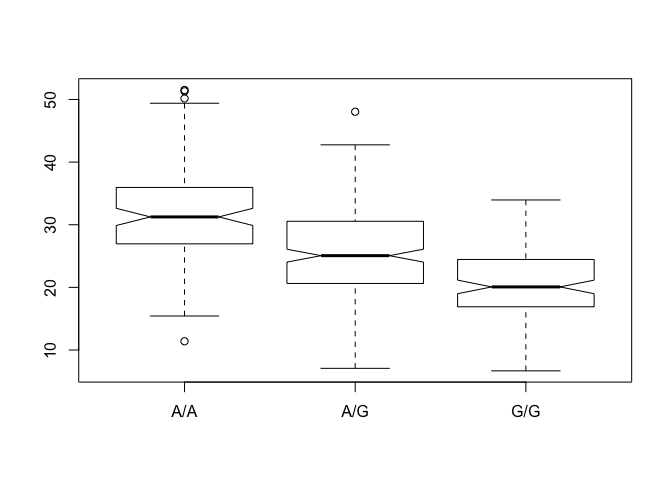

class13
================
Anusorn Mudla
5/15/2019

Today lecture is on Genome informatics and high throughput sequencing
---------------------------------------------------------------------

Section 1: Identify genetic variants of interest
================================================

Use the OMIM database to search for SNP in asthma patients and look for one of the SNP Q5:

``` r
mxl <- read.csv("373531-SampleGenotypes-Homo_sapiens_Variation_Sample_rs8067378.csv")
head(mxl)
```

    ##   Sample..Male.Female.Unknown. Genotype..forward.strand. Population.s.
    ## 1                  NA19648 (F)                       A|A ALL, AMR, MXL
    ## 2                  NA19649 (M)                       G|G ALL, AMR, MXL
    ## 3                  NA19651 (F)                       A|A ALL, AMR, MXL
    ## 4                  NA19652 (M)                       G|G ALL, AMR, MXL
    ## 5                  NA19654 (F)                       G|G ALL, AMR, MXL
    ## 6                  NA19655 (M)                       A|G ALL, AMR, MXL
    ##   Father Mother
    ## 1      -      -
    ## 2      -      -
    ## 3      -      -
    ## 4      -      -
    ## 5      -      -
    ## 6      -      -

``` r
#find out the number of each allele type
table(mxl$Genotype..forward.strand.)
```

    ## 
    ## A|A A|G G|A G|G 
    ##  22  21  12   9

``` r
#proportion
round(table(mxl$Genotype..forward.strand.)/nrow(mxl)*100,2)
```

    ## 
    ##   A|A   A|G   G|A   G|G 
    ## 34.38 32.81 18.75 14.06

Quality scores in FASTQ files
-----------------------------

``` r
library(seqinr)
library(gtools)
asc( s2c("DDDDCDEDCDDDDBBDDDCC@") )
```

    ##  D  D  D  D  C  D  E  D  C  D  D  D  D  B  B  D  D  D  C  C  @ 
    ## 68 68 68 68 67 68 69 68 67 68 68 68 68 66 66 68 68 68 67 67 64

section 4
---------

``` r
#import data
expr <- read.table("rs8067378_ENSG00000172057.6.txt",header = TRUE)
```

``` r
summary(expr)
```

    ##      sample     geno          exp        
    ##  HG00096:  1   A/A:108   Min.   : 6.675  
    ##  HG00097:  1   A/G:233   1st Qu.:20.004  
    ##  HG00099:  1   G/G:121   Median :25.116  
    ##  HG00100:  1             Mean   :25.640  
    ##  HG00101:  1             3rd Qu.:30.779  
    ##  HG00102:  1             Max.   :51.518  
    ##  (Other):456

``` r
library(dplyr)
```

    ## 
    ## Attaching package: 'dplyr'

    ## The following object is masked from 'package:seqinr':
    ## 
    ##     count

    ## The following objects are masked from 'package:stats':
    ## 
    ##     filter, lag

    ## The following objects are masked from 'package:base':
    ## 
    ##     intersect, setdiff, setequal, union

``` r
groups <- group_by(expr,geno)
```

``` r
inds <- (expr$geno == "G/G")
summary(expr[inds,]$exp)
```

    ##    Min. 1st Qu.  Median    Mean 3rd Qu.    Max. 
    ##   6.675  16.903  20.074  20.594  24.457  33.956

``` r
inds <- (expr$geno == "A/A")
summary(expr[inds,]$exp)
```

    ##    Min. 1st Qu.  Median    Mean 3rd Qu.    Max. 
    ##   11.40   27.02   31.25   31.82   35.92   51.52

``` r
inds <- (expr$geno == "A/G")
summary(expr[inds,]$exp)
```

    ##    Min. 1st Qu.  Median    Mean 3rd Qu.    Max. 
    ##   7.075  20.626  25.065  25.397  30.552  48.034

Box plot to show distribution of expression for each genotype

``` r
boxplot(data =expr, exp~geno, notch = TRUE)
```

 Plot with ggplot2

``` r
library(ggplot2)
```
