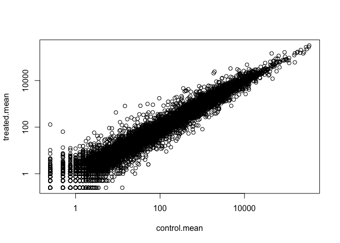
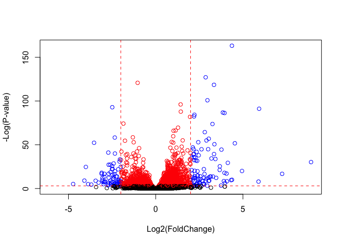

Class14: Transcriptomics and the analysis of RNA-Seq data
================
Anusorn Mudla
5/17/2019

Today lecture is Transcriptomics and the analysis of RNA-Seq data using BiocManager package.

``` r
library(BiocManager)
library(DESeq2)
```

    ## Loading required package: S4Vectors

    ## Loading required package: stats4

    ## Loading required package: BiocGenerics

    ## Loading required package: parallel

    ## 
    ## Attaching package: 'BiocGenerics'

    ## The following objects are masked from 'package:parallel':
    ## 
    ##     clusterApply, clusterApplyLB, clusterCall, clusterEvalQ,
    ##     clusterExport, clusterMap, parApply, parCapply, parLapply,
    ##     parLapplyLB, parRapply, parSapply, parSapplyLB

    ## The following objects are masked from 'package:stats':
    ## 
    ##     IQR, mad, sd, var, xtabs

    ## The following objects are masked from 'package:base':
    ## 
    ##     anyDuplicated, append, as.data.frame, basename, cbind,
    ##     colMeans, colnames, colSums, dirname, do.call, duplicated,
    ##     eval, evalq, Filter, Find, get, grep, grepl, intersect,
    ##     is.unsorted, lapply, lengths, Map, mapply, match, mget, order,
    ##     paste, pmax, pmax.int, pmin, pmin.int, Position, rank, rbind,
    ##     Reduce, rowMeans, rownames, rowSums, sapply, setdiff, sort,
    ##     table, tapply, union, unique, unsplit, which, which.max,
    ##     which.min

    ## 
    ## Attaching package: 'S4Vectors'

    ## The following object is masked from 'package:base':
    ## 
    ##     expand.grid

    ## Loading required package: IRanges

    ## Loading required package: GenomicRanges

    ## Loading required package: GenomeInfoDb

    ## Loading required package: SummarizedExperiment

    ## Loading required package: Biobase

    ## Welcome to Bioconductor
    ## 
    ##     Vignettes contain introductory material; view with
    ##     'browseVignettes()'. To cite Bioconductor, see
    ##     'citation("Biobase")', and for packages 'citation("pkgname")'.

    ## Loading required package: DelayedArray

    ## Loading required package: matrixStats

    ## 
    ## Attaching package: 'matrixStats'

    ## The following objects are masked from 'package:Biobase':
    ## 
    ##     anyMissing, rowMedians

    ## Loading required package: BiocParallel

    ## 
    ## Attaching package: 'DelayedArray'

    ## The following objects are masked from 'package:matrixStats':
    ## 
    ##     colMaxs, colMins, colRanges, rowMaxs, rowMins, rowRanges

    ## The following objects are masked from 'package:base':
    ## 
    ##     aperm, apply

``` r
counts <- read.csv("airway_scaledcounts.csv", stringsAsFactors = FALSE)
metadata <-  read.csv("airway_metadata.csv", stringsAsFactors = FALSE)
```

``` r
#Q1 nunber of genes
nrow(counts)
```

    ## [1] 38694

``` r
#Q2 control cell line
sum(metadata$dex=="control")
```

    ## [1] 4

check if the names in the counts data is the same in the metadata

``` r
all(colnames(counts)[-1]==metadata$id)
```

    ## [1] TRUE

Select the control group

``` r
control <- metadata[metadata$dex=="control",]
control.mean <- rowSums( counts[ ,control$id] )/length(control$id) 
names(control.mean) <- counts$ensgene
```

Select the treated group

``` r
treated <- metadata[metadata$dex=="treated",]
treated.mean <- rowSums( counts[ ,treated$id] )/length(treated$id) 
names(treated.mean) <- counts$ensgene
```

Combine the control.mean and treated.mean data into one dataframe

``` r
meancount <- data.frame(control.mean,treated.mean)
head(meancount)
```

    ##                 control.mean treated.mean
    ## ENSG00000000003       900.75       658.00
    ## ENSG00000000005         0.00         0.00
    ## ENSG00000000419       520.50       546.00
    ## ENSG00000000457       339.75       316.50
    ## ENSG00000000460        97.25        78.75
    ## ENSG00000000938         0.75         0.00

plot the compare the control and treated

``` r
plot(meancount,log="xy")
```

    ## Warning in xy.coords(x, y, xlabel, ylabel, log): 15032 x values <= 0
    ## omitted from logarithmic plot

    ## Warning in xy.coords(x, y, xlabel, ylabel, log): 15281 y values <= 0
    ## omitted from logarithmic plot



``` r
meancount$log2fc <- log2(meancount[,"treated.mean"]/meancount[,"control.mean"])
head(meancount)
```

    ##                 control.mean treated.mean      log2fc
    ## ENSG00000000003       900.75       658.00 -0.45303916
    ## ENSG00000000005         0.00         0.00         NaN
    ## ENSG00000000419       520.50       546.00  0.06900279
    ## ENSG00000000457       339.75       316.50 -0.10226805
    ## ENSG00000000460        97.25        78.75 -0.30441833
    ## ENSG00000000938         0.75         0.00        -Inf

Remove data that are not number

``` r
to.rm <- unique(which(meancount[,1:2]==0, arr.ind=TRUE)[,1])
mycounts <- meancount[-to.rm,]
head(mycounts)
```

    ##                 control.mean treated.mean      log2fc
    ## ENSG00000000003       900.75       658.00 -0.45303916
    ## ENSG00000000419       520.50       546.00  0.06900279
    ## ENSG00000000457       339.75       316.50 -0.10226805
    ## ENSG00000000460        97.25        78.75 -0.30441833
    ## ENSG00000000971      5219.00      6687.50  0.35769358
    ## ENSG00000001036      2327.00      1785.75 -0.38194109

find how many genes are up or down regulated for 2 fold change Up regulated genes

``` r
up.ind <- mycounts$log2fc > 2
sum(up.ind)
```

    ## [1] 250

Down regulated genes

``` r
down.ind <- mycounts$log2fc < (-2)
sum(down.ind)
```

    ## [1] 367

Looking at both up and down regulated

``` r
ind.both <- abs(mycounts$log2fc) > 2
sum(ind.both)
```

    ## [1] 617

Section 4: Adding annotation data
=================================

``` r
annotation <- read.csv("annotables_grch38.csv")
```

Use **merge()** function to add annotation to the mycounts data

``` r
mycount.anno <- merge(x=mycounts,y=annotation,by.x = "row.names",by.y = "ensgene")
```

Use BiocManager package to annotate the data

``` r
library("AnnotationDbi")
library("org.Hs.eg.db")
```

    ## 

``` r
columns(org.Hs.eg.db)
```

    ##  [1] "ACCNUM"       "ALIAS"        "ENSEMBL"      "ENSEMBLPROT" 
    ##  [5] "ENSEMBLTRANS" "ENTREZID"     "ENZYME"       "EVIDENCE"    
    ##  [9] "EVIDENCEALL"  "GENENAME"     "GO"           "GOALL"       
    ## [13] "IPI"          "MAP"          "OMIM"         "ONTOLOGY"    
    ## [17] "ONTOLOGYALL"  "PATH"         "PFAM"         "PMID"        
    ## [21] "PROSITE"      "REFSEQ"       "SYMBOL"       "UCSCKG"      
    ## [25] "UNIGENE"      "UNIPROT"

``` r
mycounts$symbol <- mapIds(org.Hs.eg.db,
                   keys=row.names(mycounts),
                   keytype="ENSEMBL",
                   column="SYMBOL",
                   multiVals="first")
```

    ## 'select()' returned 1:many mapping between keys and columns

``` r
mycounts$entrez <- mapIds(org.Hs.eg.db,
                     keys=row.names(mycounts),
                     column="ENTREZID",
                     keytype="ENSEMBL",
                     multiVals="first")
```

    ## 'select()' returned 1:many mapping between keys and columns

``` r
mycounts$uniprot <- mapIds(org.Hs.eg.db,
                     keys=row.names(mycounts),
                     column="UNIPROT",
                     keytype="ENSEMBL",
                     multiVals="first")
```

    ## 'select()' returned 1:many mapping between keys and columns

``` r
head(mycounts)
```

    ##                 control.mean treated.mean      log2fc   symbol entrez
    ## ENSG00000000003       900.75       658.00 -0.45303916   TSPAN6   7105
    ## ENSG00000000419       520.50       546.00  0.06900279     DPM1   8813
    ## ENSG00000000457       339.75       316.50 -0.10226805    SCYL3  57147
    ## ENSG00000000460        97.25        78.75 -0.30441833 C1orf112  55732
    ## ENSG00000000971      5219.00      6687.50  0.35769358      CFH   3075
    ## ENSG00000001036      2327.00      1785.75 -0.38194109    FUCA2   2519
    ##                    uniprot
    ## ENSG00000000003 A0A024RCI0
    ## ENSG00000000419     O60762
    ## ENSG00000000457     Q8IZE3
    ## ENSG00000000460 A0A024R922
    ## ENSG00000000971 A0A024R962
    ## ENSG00000001036     Q9BTY2

Section 5: DESeq2 analysis
==========================

``` r
library(DESeq2)
```

``` r
dds <- DESeqDataSetFromMatrix(countData=counts, 
                              colData=metadata, 
                              design=~dex, 
                              tidy=TRUE)
```

    ## converting counts to integer mode

    ## Warning in DESeqDataSet(se, design = design, ignoreRank): some variables in
    ## design formula are characters, converting to factors

``` r
dds
```

    ## class: DESeqDataSet 
    ## dim: 38694 8 
    ## metadata(1): version
    ## assays(1): counts
    ## rownames(38694): ENSG00000000003 ENSG00000000005 ...
    ##   ENSG00000283120 ENSG00000283123
    ## rowData names(0):
    ## colnames(8): SRR1039508 SRR1039509 ... SRR1039520 SRR1039521
    ## colData names(4): id dex celltype geo_id

``` r
dds <- DESeq(dds)
```

    ## estimating size factors

    ## estimating dispersions

    ## gene-wise dispersion estimates

    ## mean-dispersion relationship

    ## final dispersion estimates

    ## fitting model and testing

``` r
res <- results(dds)
res <- as.data.frame(res)
summary(res)
```

    ##     baseMean        log2FoldChange       lfcSE            stat        
    ##  Min.   :     0.0   Min.   :-6.030   Min.   :0.057   Min.   :-15.894  
    ##  1st Qu.:     0.0   1st Qu.:-0.425   1st Qu.:0.174   1st Qu.: -0.643  
    ##  Median :     1.1   Median :-0.009   Median :0.445   Median : -0.027  
    ##  Mean   :   570.2   Mean   :-0.011   Mean   :1.136   Mean   :  0.045  
    ##  3rd Qu.:   201.8   3rd Qu.: 0.306   3rd Qu.:1.848   3rd Qu.:  0.593  
    ##  Max.   :329280.4   Max.   : 8.906   Max.   :3.534   Max.   : 18.422  
    ##                     NA's   :13436    NA's   :13436   NA's   :13436    
    ##      pvalue           padj      
    ##  Min.   :0.000   Min.   :0.000  
    ##  1st Qu.:0.168   1st Qu.:0.203  
    ##  Median :0.533   Median :0.606  
    ##  Mean   :0.495   Mean   :0.539  
    ##  3rd Qu.:0.800   3rd Qu.:0.866  
    ##  Max.   :1.000   Max.   :1.000  
    ##  NA's   :13578   NA's   :23549

``` r
res05 <- results(dds,alpha=0.05)
summary(res05)
```

    ## 
    ## out of 25258 with nonzero total read count
    ## adjusted p-value < 0.05
    ## LFC > 0 (up)       : 1236, 4.9%
    ## LFC < 0 (down)     : 933, 3.7%
    ## outliers [1]       : 142, 0.56%
    ## low counts [2]     : 9033, 36%
    ## (mean count < 6)
    ## [1] see 'cooksCutoff' argument of ?results
    ## [2] see 'independentFiltering' argument of ?results

Section 6: Volcano plot
=======================

``` r
# add color to the dots
mycols <- rep("black", nrow(res))
mycols[ res$padj <0.05 ]  <- "red" 

mycols[res$padj < 0.05 & abs(res$log2FoldChange) > 2] <- "blue"

# plot
plot( res$log2FoldChange,  -log(res$padj), 
      xlab="Log2(FoldChange)",
      ylab="-Log(P-value)",
      col = mycols)

# Add some cut-off lines
abline(v=c(-2,2), col="red", lty=2)
abline(h=-log(0.05), col="red", lty=2)
```



Another way to plot the graph with the Enhanced. But first need to put proper

``` r
x <- as.data.frame(res)
x$symbol <- mapIds(org.Hs.eg.db, 
                   keys=row.names(x),
                   keytype="ENSEMBL",
                   column="SYMBOL",
                   multiVals="first")
```

    ## 'select()' returned 1:many mapping between keys and columns

``` r
#BiocManager::install("EnhancedVolcano")
```

``` r
library(EnhancedVolcano)
```

    ## Loading required package: ggplot2

    ## Loading required package: ggrepel

``` r
EnhancedVolcano(x,
    lab = x$symbol,
    x = 'log2FoldChange',
    y = 'pvalue')
```

    ## Warning: Removed 13578 rows containing missing values (geom_point).

    ## Warning: Removed 24 rows containing missing values (geom_text).


