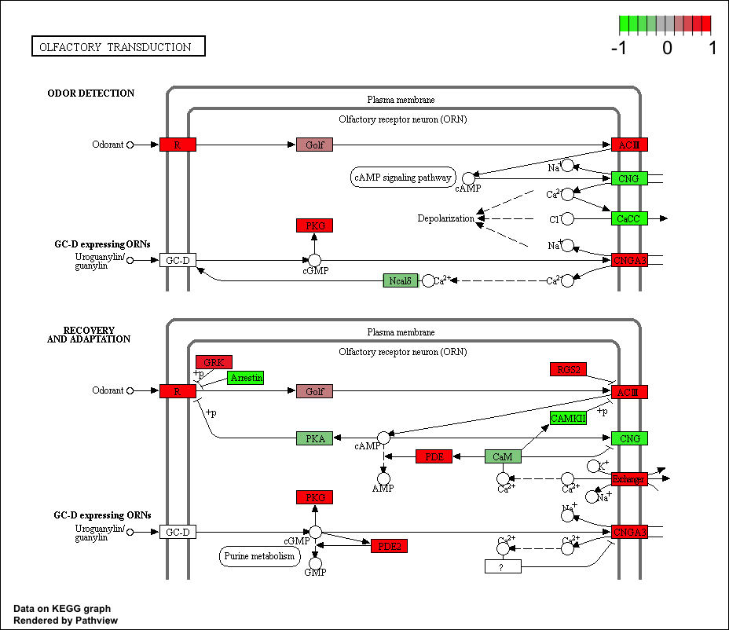
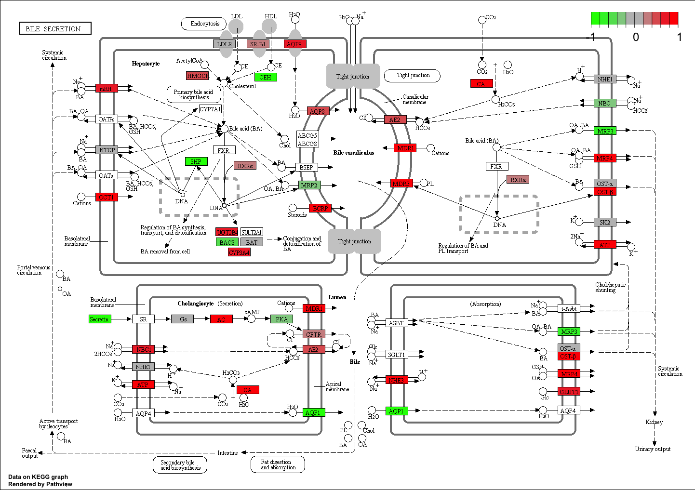

```{r setup, include=FALSE}
knitr::opts_chunk$set(echo = TRUE, warning = FALSE, message = FALSE)
```

# Section 1: Differential Expression Analysis
```{r results="hide"}
library(DESeq2)
```
```{r}
metafile <- "GSE37704_metadata.csv"
countfile <- "GSE37704_featurecounts.csv"
# Import metadata and take a peak
colData = read.csv(metafile, row.names=1)
head(colData)

# Import countdata
countData = read.csv(countfile, row.names=1)
head(countData)

```
Clean-up the data
```{r}
# Note we need to remove the odd first $length col
countData <- as.matrix(countData[,-1])
head(countData)
```

```{r}
# Filter count data where you have 0 read count across all samples.
to.rm <- rowSums(countData==0)
countData <- countData[-to.rm,]
head(countData)
nrow(countData)
```

Running DESeq2
```{r}
dds = DESeqDataSetFromMatrix(countData=countData,
                             colData=colData,
                             design=~condition)
dds = DESeq(dds)
```

```{r}
res <- results(dds)
summary(res)
```

```{r}
mycolor <- rep("black",nrow(res))
mycolor[abs(res$log2FoldChange)>2] <- "red"
inds <- (res$padj<0.01) & (abs(res$log2FoldChange) > 2 )
mycolor[ inds ] <- "blue"

plot(res$log2FoldChange,-log(res$padj),col = mycolor,xlab = "log2(FoldChange)",ylab ="-log(p-value)")
abline(h=0.01,v = c(-2,2),col = "green")
```
```{r results="hide"}

library("AnnotationDbi")
library("org.Hs.eg.db")

columns(org.Hs.eg.db)

res$symbol = mapIds(org.Hs.eg.db,
                    keys=row.names(res), #key is things in our data that we want to translate
                    keytype="ENSEMBL",
                    column="SYMBOL",
                    multiVals="first")

res$entrez = mapIds(org.Hs.eg.db,
                    keys=row.names(res),
                    keytype="ENSEMBL",
                    column="ENTREZID",
                    multiVals="first")

res$name =   mapIds(org.Hs.eg.db,
                    keys=row.names(res),
                    keytype="ENSEMBL",
                    column="GENENAME",
                    multiVals="first")

head(res, 10)

```

```{r}
res = res[order(res$pvalue),]
write.csv(res, file = "deseq_results.csv")
```

#Section 2. Pathway Analysis
```{r results="hide"}
library(pathview)
library(gage)
library(gageData)

data(kegg.sets.hs)
data(sigmet.idx.hs)

# Focus on signaling and metabolic pathways only
kegg.sets.hs = kegg.sets.hs[sigmet.idx.hs]

# Examine the first 3 pathways
head(kegg.sets.hs, 3)
```
The **gage** package wants a vector data with entrez names and foldchange information
```{r}
foldchanges = res$log2FoldChange # get foldchange data
names(foldchanges) = res$entrez # assign names
head(foldchanges)
```

```{r}
# Get the results
keggres = gage(foldchanges, gsets=kegg.sets.hs)
```

```{r}
attributes(keggres)
```
```{r}
# Look at the first few down (less) pathways
head(keggres$less)
```
```{r results="hide"}
pathview(gene.data=foldchanges, pathway.id="hsa04110")
```


```{r results="hide"}
pathview(gene.data=foldchanges, pathway.id="hsa00010")
```

Generate pdf format of these pathways
```{r}
pathview(gene.data=foldchanges, pathway.id="hsa04110", kegg.native=FALSE)
```

```{r}
## Focus on top 5 upregulated pathways here for demo purposes only
keggrespathways <- rownames(keggres$greater)[1:5]

# Extract the 8 character long IDs part of each string
keggresids = substr(keggrespathways, start=1, stop=8)
keggresids
```
looking at all 5 pathways
```{r results="hide"}
pathview(gene.data=foldchanges, pathway.id=keggresids, species="hsa")
```




##Section 3. Gene Ontology (GO)
```{r}
data(go.sets.hs)
data(go.subs.hs)

# Focus on Biological Process subset of GO
gobpsets = go.sets.hs[go.subs.hs$BP]

gobpres = gage(foldchanges, gsets=gobpsets, same.dir=TRUE)

lapply(gobpres, head)
```

#Section 4: Reactome Analysis
```{r}
sig_genes <- res[res$padj <= 0.05 & !is.na(res$padj), "symbol"]
print(paste("Total number of significant genes:", length(sig_genes)))
```
```{r}
write.table(sig_genes, file="significant_genes.txt", row.names=FALSE, col.names=FALSE, quote=FALSE)
```

go to (https://reactome.org/PathwayBrowser/#TOOL=AT) and upload "significant_genes.txt" to perform the analysis

# Section 5: GO online
Go to http://www.geneontology.org/page/go-enrichment-analysis and paste the gene names from section 4
