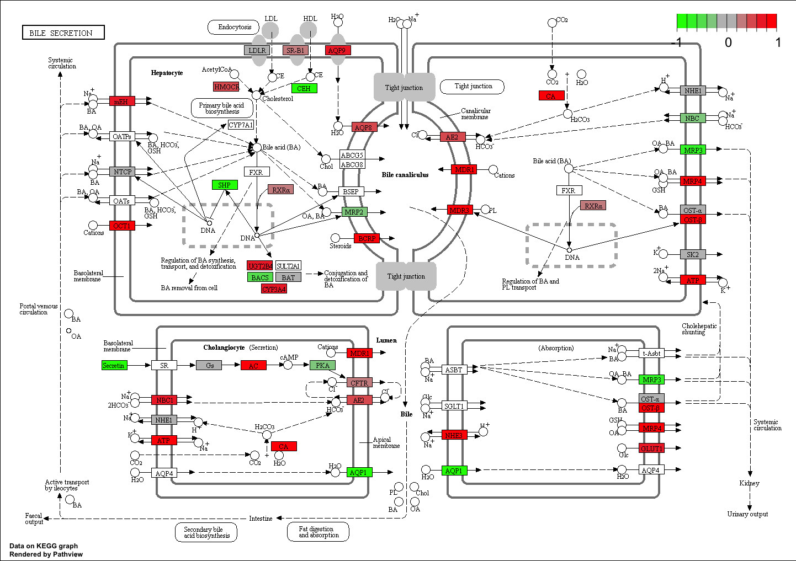

class15
================
Anusorn Mudla
5/22/2019

Section 1: Differential Expression Analysis
===========================================

``` r
library(DESeq2)
```

``` r
metafile <- "GSE37704_metadata.csv"
countfile <- "GSE37704_featurecounts.csv"
# Import metadata and take a peak
colData = read.csv(metafile, row.names=1)
head(colData)
```

    ##               condition
    ## SRR493366 control_sirna
    ## SRR493367 control_sirna
    ## SRR493368 control_sirna
    ## SRR493369      hoxa1_kd
    ## SRR493370      hoxa1_kd
    ## SRR493371      hoxa1_kd

``` r
# Import countdata
countData = read.csv(countfile, row.names=1)
head(countData)
```

    ##                 length SRR493366 SRR493367 SRR493368 SRR493369 SRR493370
    ## ENSG00000186092    918         0         0         0         0         0
    ## ENSG00000279928    718         0         0         0         0         0
    ## ENSG00000279457   1982        23        28        29        29        28
    ## ENSG00000278566    939         0         0         0         0         0
    ## ENSG00000273547    939         0         0         0         0         0
    ## ENSG00000187634   3214       124       123       205       207       212
    ##                 SRR493371
    ## ENSG00000186092         0
    ## ENSG00000279928         0
    ## ENSG00000279457        46
    ## ENSG00000278566         0
    ## ENSG00000273547         0
    ## ENSG00000187634       258

Clean-up the data

``` r
# Note we need to remove the odd first $length col
countData <- as.matrix(countData[,-1])
head(countData)
```

    ##                 SRR493366 SRR493367 SRR493368 SRR493369 SRR493370
    ## ENSG00000186092         0         0         0         0         0
    ## ENSG00000279928         0         0         0         0         0
    ## ENSG00000279457        23        28        29        29        28
    ## ENSG00000278566         0         0         0         0         0
    ## ENSG00000273547         0         0         0         0         0
    ## ENSG00000187634       124       123       205       207       212
    ##                 SRR493371
    ## ENSG00000186092         0
    ## ENSG00000279928         0
    ## ENSG00000279457        46
    ## ENSG00000278566         0
    ## ENSG00000273547         0
    ## ENSG00000187634       258

``` r
# Filter count data where you have 0 read count across all samples.
to.rm <- rowSums(countData==0)
countData <- countData[-to.rm,]
head(countData)
```

    ##                 SRR493366 SRR493367 SRR493368 SRR493369 SRR493370
    ## ENSG00000188976      1637      1831      2383      1226      1326
    ## ENSG00000187961       120       153       180       236       255
    ## ENSG00000187583        24        48        65        44        48
    ## ENSG00000187642         4         9        16        14        16
    ## ENSG00000188290        31        34        57       172       172
    ## ENSG00000187608       244       289       386       373       422
    ##                 SRR493371
    ## ENSG00000188976      1504
    ## ENSG00000187961       357
    ## ENSG00000187583        64
    ## ENSG00000187642        16
    ## ENSG00000188290       223
    ## ENSG00000187608       430

``` r
nrow(countData)
```

    ## [1] 19802

Running DESeq2

``` r
dds = DESeqDataSetFromMatrix(countData=countData,
                             colData=colData,
                             design=~condition)
dds = DESeq(dds)
```

``` r
res <- results(dds)
summary(res)
```

    ## 
    ## out of 15973 with nonzero total read count
    ## adjusted p-value < 0.1
    ## LFC > 0 (up)       : 4357, 27%
    ## LFC < 0 (down)     : 4408, 28%
    ## outliers [1]       : 0, 0%
    ## low counts [2]     : 1529, 9.6%
    ## (mean count < 1)
    ## [1] see 'cooksCutoff' argument of ?results
    ## [2] see 'independentFiltering' argument of ?results

``` r
mycolor <- rep("black",nrow(res))
mycolor[abs(res$log2FoldChange)>2] <- "red"
inds <- (res$padj<0.01) & (abs(res$log2FoldChange) > 2 )
mycolor[ inds ] <- "blue"

plot(res$log2FoldChange,-log(res$padj),col = mycolor,xlab = "log2(FoldChange)",ylab ="-log(p-value)")
abline(h=0.01,v = c(-2,2),col = "green")
```


``` r
library("AnnotationDbi")
library("org.Hs.eg.db")

columns(org.Hs.eg.db)

res$symbol = mapIds(org.Hs.eg.db,
                    keys=row.names(res), #key is things in our data that we want to translate
                    keytype="ENSEMBL",
                    column="SYMBOL",
                    multiVals="first")

res$entrez = mapIds(org.Hs.eg.db,
                    keys=row.names(res),
                    keytype="ENSEMBL",
                    column="ENTREZID",
                    multiVals="first")

res$name =   mapIds(org.Hs.eg.db,
                    keys=row.names(res),
                    keytype="ENSEMBL",
                    column="GENENAME",
                    multiVals="first")

head(res, 10)
```

``` r
res = res[order(res$pvalue),]
write.csv(res, file = "deseq_results.csv")
```

Section 2. Pathway Analysis
===========================

``` r
library(pathview)
library(gage)
library(gageData)

data(kegg.sets.hs)
data(sigmet.idx.hs)

# Focus on signaling and metabolic pathways only
kegg.sets.hs = kegg.sets.hs[sigmet.idx.hs]

# Examine the first 3 pathways
head(kegg.sets.hs, 3)
```

The **gage** package wants a vector data with entrez names and foldchange information

``` r
foldchanges = res$log2FoldChange # get foldchange data
names(foldchanges) = res$entrez # assign names
head(foldchanges)
```

    ##      1266     54855      1465     51232      2034      2317 
    ## -2.422656  3.202017 -2.313674 -2.059567 -1.887955 -1.649727

``` r
# Get the results
keggres = gage(foldchanges, gsets=kegg.sets.hs)
```

``` r
attributes(keggres)
```

    ## $names
    ## [1] "greater" "less"    "stats"

``` r
# Look at the first few down (less) pathways
head(keggres$less)
```

    ##                                          p.geomean stat.mean        p.val
    ## hsa04110 Cell cycle                   7.088745e-06 -4.432237 7.088745e-06
    ## hsa03030 DNA replication              9.433633e-05 -3.951509 9.433633e-05
    ## hsa03013 RNA transport                9.147180e-04 -3.153413 9.147180e-04
    ## hsa04114 Oocyte meiosis               2.566266e-03 -2.826979 2.566266e-03
    ## hsa03440 Homologous recombination     3.068576e-03 -2.852682 3.068576e-03
    ## hsa00010 Glycolysis / Gluconeogenesis 4.363460e-03 -2.663551 4.363460e-03
    ##                                             q.val set.size         exp1
    ## hsa04110 Cell cycle                   0.001162554      124 7.088745e-06
    ## hsa03030 DNA replication              0.007735579       36 9.433633e-05
    ## hsa03013 RNA transport                0.050004585      150 9.147180e-04
    ## hsa04114 Oocyte meiosis               0.100649277      112 2.566266e-03
    ## hsa03440 Homologous recombination     0.100649277       28 3.068576e-03
    ## hsa00010 Glycolysis / Gluconeogenesis 0.119267900       65 4.363460e-03

``` r
pathview(gene.data=foldchanges, pathway.id="hsa04110")
```


``` r
pathview(gene.data=foldchanges, pathway.id="hsa00010")
```

Generate pdf format of these pathways

``` r
pathview(gene.data=foldchanges, pathway.id="hsa04110", kegg.native=FALSE)
```

``` r
## Focus on top 5 upregulated pathways here for demo purposes only
keggrespathways <- rownames(keggres$greater)[1:5]

# Extract the 8 character long IDs part of each string
keggresids = substr(keggrespathways, start=1, stop=8)
keggresids
```

    ## [1] "hsa04740" "hsa04640" "hsa00140" "hsa04630" "hsa04976"

looking at all 5 pathways

``` r
pathview(gene.data=foldchanges, pathway.id=keggresids, species="hsa")
```

     \#\#Section 3. Gene Ontology (GO)

``` r
data(go.sets.hs)
data(go.subs.hs)

# Focus on Biological Process subset of GO
gobpsets = go.sets.hs[go.subs.hs$BP]

gobpres = gage(foldchanges, gsets=gobpsets, same.dir=TRUE)

lapply(gobpres, head)
```

    ## $greater
    ##                                               p.geomean stat.mean
    ## GO:0007156 homophilic cell adhesion        1.622883e-05  4.226291
    ## GO:0048729 tissue morphogenesis            5.399194e-05  3.888869
    ## GO:0002009 morphogenesis of an epithelium  5.719588e-05  3.879053
    ## GO:0030855 epithelial cell differentiation 2.051573e-04  3.555054
    ## GO:0060562 epithelial tube morphogenesis   2.924611e-04  3.458763
    ## GO:0048598 embryonic morphogenesis         2.954529e-04  3.446965
    ##                                                   p.val      q.val
    ## GO:0007156 homophilic cell adhesion        1.622883e-05 0.07098489
    ## GO:0048729 tissue morphogenesis            5.399194e-05 0.08339160
    ## GO:0002009 morphogenesis of an epithelium  5.719588e-05 0.08339160
    ## GO:0030855 epithelial cell differentiation 2.051573e-04 0.14628384
    ## GO:0060562 epithelial tube morphogenesis   2.924611e-04 0.14628384
    ## GO:0048598 embryonic morphogenesis         2.954529e-04 0.14628384
    ##                                            set.size         exp1
    ## GO:0007156 homophilic cell adhesion             138 1.622883e-05
    ## GO:0048729 tissue morphogenesis                 483 5.399194e-05
    ## GO:0002009 morphogenesis of an epithelium       382 5.719588e-05
    ## GO:0030855 epithelial cell differentiation      299 2.051573e-04
    ## GO:0060562 epithelial tube morphogenesis        289 2.924611e-04
    ## GO:0048598 embryonic morphogenesis              498 2.954529e-04
    ## 
    ## $less
    ##                                             p.geomean stat.mean
    ## GO:0048285 organelle fission             7.216866e-16 -8.159236
    ## GO:0000280 nuclear division              1.958183e-15 -8.039722
    ## GO:0007067 mitosis                       1.958183e-15 -8.039722
    ## GO:0000087 M phase of mitotic cell cycle 5.168018e-15 -7.903881
    ## GO:0007059 chromosome segregation        1.084735e-11 -6.974104
    ## GO:0051301 cell division                 8.753221e-11 -6.454861
    ##                                                 p.val        q.val
    ## GO:0048285 organelle fission             7.216866e-16 2.855031e-12
    ## GO:0000280 nuclear division              1.958183e-15 2.855031e-12
    ## GO:0007067 mitosis                       1.958183e-15 2.855031e-12
    ## GO:0000087 M phase of mitotic cell cycle 5.168018e-15 5.651227e-12
    ## GO:0007059 chromosome segregation        1.084735e-11 9.489260e-09
    ## GO:0051301 cell division                 8.753221e-11 6.381098e-08
    ##                                          set.size         exp1
    ## GO:0048285 organelle fission                  386 7.216866e-16
    ## GO:0000280 nuclear division                   362 1.958183e-15
    ## GO:0007067 mitosis                            362 1.958183e-15
    ## GO:0000087 M phase of mitotic cell cycle      373 5.168018e-15
    ## GO:0007059 chromosome segregation             146 1.084735e-11
    ## GO:0051301 cell division                      479 8.753221e-11
    ## 
    ## $stats
    ##                                            stat.mean     exp1
    ## GO:0007156 homophilic cell adhesion         4.226291 4.226291
    ## GO:0048729 tissue morphogenesis             3.888869 3.888869
    ## GO:0002009 morphogenesis of an epithelium   3.879053 3.879053
    ## GO:0030855 epithelial cell differentiation  3.555054 3.555054
    ## GO:0060562 epithelial tube morphogenesis    3.458763 3.458763
    ## GO:0048598 embryonic morphogenesis          3.446965 3.446965

Section 4: Reactome Analysis
============================

``` r
sig_genes <- res[res$padj <= 0.05 & !is.na(res$padj), "symbol"]
print(paste("Total number of significant genes:", length(sig_genes)))
```

    ## [1] "Total number of significant genes: 8156"

``` r
write.table(sig_genes, file="significant_genes.txt", row.names=FALSE, col.names=FALSE, quote=FALSE)
```

go to (<https://reactome.org/PathwayBrowser/#TOOL=AT>) and upload "significant\_genes.txt" to perform the analysis

Section 5: GO online
====================

Go to <http://www.geneontology.org/page/go-enrichment-analysis> and paste the gene names from section 4
